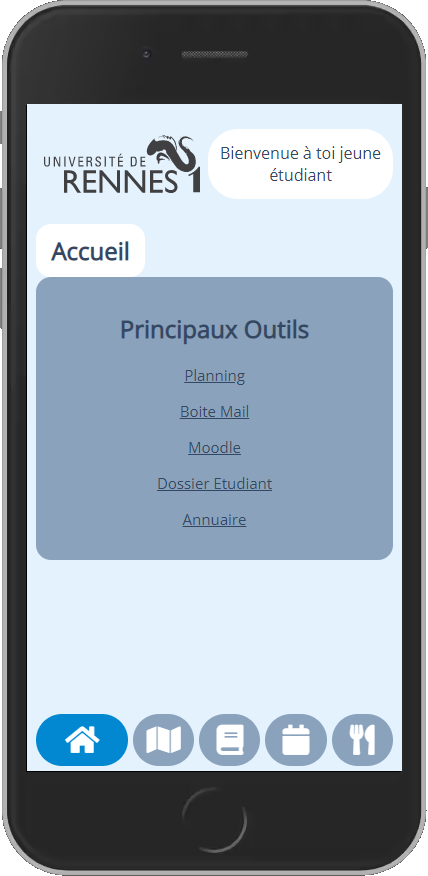

Projet :
- faire un ENT plus joli
- plus ergonomique
- avec plus d'infos

Lien d'accès : https://aquabx.github.io/univ

to do list :
- finir la carte
- peaufiner le design
- ajouter des fontionalités

Toute suggestion ou aide externe est la bienvenue. 

